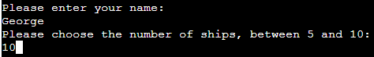
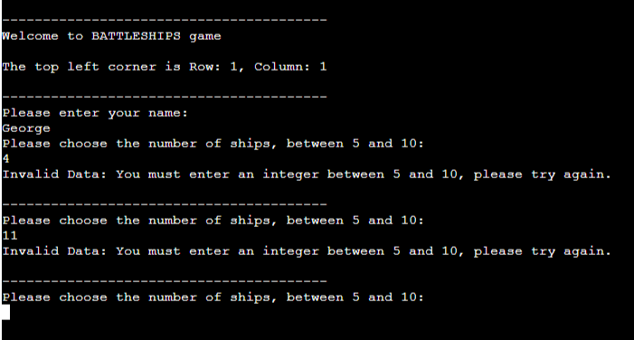

# Ultimate Battleships

Ultimate Battleships is a python game, which runs in the Code Institute mock terminal on Heroku.

Users can try and sink all of the computer's ships before the computer sinks all of their ships. Each battleship occupies one square on the board. Users try and hit them by calling out the coordinates of one of the squares on the board.

[Here is the live version of my project](https://ultimate-battleship-game.herokuapp.com/)

.png)

## How to play
----

Ultimate Battleships is based on the classic pen-and-paper game. You can read more about it on [Wikipedia](https://en.wikipedia.org/wiki/Battleship_(game))

In this version, the player enters their name and the desired amount of ships then two boards are randomly generated.

The player can see where their ships are, indicated by an `@` sign, but cannot see where the computer's ships are.

If guesses miss, they are marked on the board with an `X`.

If guesses hit, they are indicated by `*`.

The player and the computer then take it in turns to make guesses and try to sink each other's battleships.

The winner is the player who sinks all of their opponent's ships first.

## Design
----

### Flow Diagram

To structure and aid tin creating the game, a basic flow diagram was created which is linked below.

[Flow Diagram]()

### Wireframes

Please see below, a link to wireframes for the game layout.

[Wireframes]()

## Features
----

### Existing Features

+ #### Introduction to the game

    
+ #### Accepts user name input

    
+ #### Accepts user desired amount of ships (between 5 and 10)

    

+ #### Random board generation

    + Ships are randomly placed on both the player and the computer boards.
    + The player cannot see where the computer's ships are.

    

+ #### Play against the computer

+ #### Accepts user desired row and column

    

+ #### Maintains scores

    

+ #### Asks the user after every round if they want to continue playing or quit
    + User have two choices:
        + User enters `n`, in that case the game will quit and restart

            

        + User enters any key other than `n`,  in that case the game will continue

            

+ #### Provides informative message when the game ends
    + Three possible ways that the game would end up with
        + If the player wins the game, the following message appears

            

        + If the player loses the game, the following message appears

            

        + If both the player and the computer destroy all of each other ships at the same turn, the following message appears

            

+ #### Input validation and error-checking
    + User cannot enter an empty name

        

    + User must enter an integer to the number of ships input

        

    + User cannot enter number of ships that is lower than 5 or higher than 10

        

    + User must enter an integer to both the row and column guesses

        

    + User cannot guess a row or a column that is lower than 1 or higher than 5

        

    + User cannot enter the same guess (coordinates) twice

        