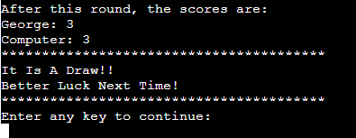

# Ultimate Battleships

Ultimate Battleships is a python game, which runs in the Code Institute mock terminal on Heroku.

Users can try and sink all of the computer's ships before the computer sinks all of their ships. Each battleship occupies one square on the board. Users try and hit them by calling out the coordinates of one of the squares on the board.

[Here is the live version of my project](https://ultimate-battleship-game.herokuapp.com/)

## How to play
----

Ultimate Battleships is based on the classic pen-and-paper game. You can read more about it on [Wikipedia](https://en.wikipedia.org/wiki/Battleship_(game))

In this version, the player enters their name, the board size and the desired amount of ships, then two boards are randomly generated.

The player can see where their ships are, indicated by an `@` sign, but cannot see where the computer's ships are.

If guesses miss, they are marked on the board with an `X`.

If guesses hit, they are indicated by `*`.

The player and the computer then take it in turns to make guesses and try to sink each other's battleships.

The winner is the player who sinks all of their opponent's ships first.

## Design
----

### Flow Diagram

To structure and aid tin creating the game, a basic flow diagram was created which is linked below.

[Flow Diagram]()

### Wireframes

Please see below, a link to wireframes for the game layout.

[Wireframes]()

## Features
----

### Existing Features

+ #### Introduction to the game

    
+ #### Accepts user name input

    

+ #### Accepts user desired board size (between 3 and 10)

    
+ #### Accepts user desired amount of ships
    + The amount of ships is based on the size of the board.
    + The amount of ships must be between x and (x ^2^ - x), where x represents the size of the board.

    

+ #### Random board generation

    + Ships are randomly placed on both the player and the computer boards, the board size and the amount of ships are chosen by the user.
    + The player cannot see where the computer's ships are.

    

+ #### Play against the computer

+ #### Accepts user desired row and column

    

+ #### Maintains scores

    

+ #### Asks the user after every round if they want to continue playing or quit
    + User have two choices:
        + User enters `n`, in that case the game will quit and restart

            

        + User enters any key other than `n`,  in that case the game will continue

            

+ #### Provides informative message when the game ends
    + Three possible ways that the game would end up with
        + If the player wins the game, the following message appears

            

        + If the player loses the game, the following message appears

            

        + If both the player and the computer destroy all of each other ships at the same turn, the following message appears

            

+ #### Input validation and error-checking
    + User cannot enter an empty name

        

    + User must enter an integer to the board size input

        

    + User cannot enter board size number that is:
        + Lower than 3
        + Higher than 10

        

    + User must enter an integer to the number of ships input

        

    + User cannot enter number of ships that is:
        + Lower than the board size.
        + Higher than board size * board size - board size or (x ^2^ - x)

        

    + User must enter an integer to both the row and column guesses

        

    + User cannot guess a row or a column that is lower than 1 or higher than 5

        

    + User cannot enter the same guess (coordinates) twice

        

### Features Left to Implement

+ Allow player to position ships themselves.
+ Have ships larger than 1x1.
+ Allow players to change diffulty by changing the size of each board separately.

## User Experience
----
+ **User Story 001:** as a user I want to enter my name.
    + **Tasks:** when the game starts, it will welcome you to the game with basic information, then it is going to ask you "Please enter your name:" that's when you can type your name and press `Enter` when you are done.
+ **User Story 002:** as a user I want to choose the board size.
    + **Tasks:** after you type your name, the game will ask you "Please enter the board size between 3 and 10:". That's when you can type the desired board size between 3 and 10 and press `Enter` when you are done.
+ **User Story 002:** as a user I want to choose the amount of ships.
    + **Tasks:** after choosing the board size, the game will ask you "Please choose the number of ships, between (board size) and (board size * board size - board size)". That's when you can type the desired number of ships and press `Enter` when you are done.
+ **User Story 003:** as a user I want to choose a row and a column.
    + **Tasks:** after choosing the desired amount of ships, the game will ask you "Guess a row:" that's when you can type the desired raw number between 1 and 5 and press `Enter` when you are done. After that the game will ask you "Guess a column" that's when you can type the desired column number between 1 and 5 and press `Enter` when you are done.
+ **User Story 004:** as a user I want to see both of my board and the computer's board.
    + **Tasks:** after choosing the desired row and column, the game will show you both of your board and the computer's board, providing information whether you and the computer have missed or got a hit.
+ **User Story 005:** as a user I want to know what is my score and the computer's score.
    + **Tasks:** after each turn/guess, the game will say "After this round, the scores are: " "You: ?, Computer: ?".
+ **User Story 006:** as a user I want to know when I am able to quit the game.
    + **Tasks:** after each turn/guess and after the game showing you the scores, the game will ask you "Enter any key to continue or "n" to quit". Type `n` and press `Enter`, that will make the game quit and restart. Typing anything else than `n` and pressing `Enter` will make the game continue.

## Data Model
----
+ I decided to use a Board class as my model. The game creates two instances of the Board class to hold the player's and the computer's board.

+ The Board class stores the player's name, the board size, number of ships on the board and the board type (player's board or computer's board)

+ The class also has 5 methods which are:
    1. `get_player_name()` is to ask the user to type their name
    2. `get_board_size()` is to ask the user to choose a board size
    3. `get_number_of_ships()` is to ask the user to choose number of ships
    4. `print_the_player_board()` is to create the player's board and print it
    5.  `print_the_computer_board()` is to create the computer's board and print it

## Testing
